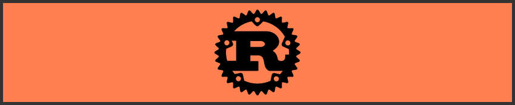

<h1 align="center">Rust Book Adventure</h1>

    

This repository aims to be an archive of my adventure to learn the Rust progamming lanuage and become a Rustacean.The code here follows the [Rust Book](https://doc.rust-lang.org/stable/book/title-page.html) in the Rust documentation.